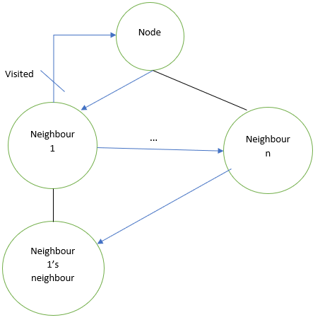

# IPFS Nodes Crawler
## Objective
The goal of this application is to use the IPFS API to build a crawler in the IPFS network, retrieving the nodes (Peers) which are part of it.
## Structure
The idea of the crawler is to go over the DHT annotating each neighbor to a certain node. This process is repeated in a Breadth Search algorithm to retrieve the list of all nodes in the network. To avoid cycles, a list of visited nodes is kept, using a hashmap to improve the accessing time for it.

Similarly, a crawler could be implemented by parsing all the nodes associated to a certain content ID. However, for this approach to be representative, the node running the crawler should have access to a significant part of the content hashkeys (or else try to brute force all possible ones), which is not the goal of the application.

## Implementation 
This code uses both the HTTP REST and Core API. The queries made to the APIs are:
 \- Connect(), to create a node and connect it to the network
 \- Swarm(), to get the swarm of nodes that are connected to the new node
 \- Dht(), to retrieve the DHT table. There are a few considerations here:
       \-- For the DHT table, only the HTTP API (also JS core API and CLI, but those are not implemented here) have access to the neightbors (closest peers) to a node. Thus, only the HTTP API is used for that. 
       \-- A similar crawler (with a different implementation) could be obtained by using the DhtAPI.getPeers() method in the go-Core API, which returns the peers hosting a specific file. 
       \-- The dht/get method used from the HTTP API returns a set of JSONs (one per neightbor). This message is too big for hosting it in the memory, so it is backed-up in a temporal file for processing. 

## Running the application 
For the app to function, the ipfs deamon shall be running with "ipfs daemon &". Then, the application is run with "go run . ". It shows two metrics, each time that it processes a Node: lenght of the Hash Table so far (discovered nodes) and churn (which of these nodes are disconnected from the network.
